# Overview - just starting 
In this sample tutorial, I create a function which generates cohors and analyze some of their dynamics.

#### Table of Contents
- [1. R and Data preparation ](#1-r-and-data-preparation)
    - [1.1. Required R packages](#11-required-r-packages)
    - [1.2. Load and prepare the data series](1.2.-load-and-prepare-the-data-series)
    - [1.3. Data quality](#13-data-quality)
- [2. Analysis](#2-analysis)
    - [2.1. Helicopter view of the data](#21-helicopter-view-of-the-data)
    - [2.2. Graph with outliers and smoothing curves](#22-graph-with-outliers-and-smoothing-curves)
    - [2.3. Statistical characteristics](#23-statistical-characteristics)
       - [2.3.1. Autocorrelation structure](#231-autocorrelation-structure)
       - [2.3.2. Breaks](#232-breaks)
       - [2.3.3. Stationarity](#233-stationarity)
    - [2.4. ARIMAX modelling](#24-arimax-modelling)
- [3. Forecasting](#3-forecasting)
    - [3.1. Forecasting without breaks](#31-forecasting-without-breaks)
    - [3.2. Forecasting without breaks](#32-forecasting-without-breaks)
- [4. Decision making](#4-decision-making)
- [5. Expansions](#5-expansions)


# 1. R and Data preparation 
## 1.1. Required R packages
For the analysis, start by installing the necessary packages.
This step can be skipped if we have already installed the necessary packages.


```r
sapply(c('astsa', 'forecastxgb', 'TStools', 'smooth', 'GDMH', 'caret', 'nnet', 'tsoutliers', 'colorout', 'data.table', 'randomNames', 'xtable', 'lubridate', 'compare', 'ggplot2', 'zoo',
     'scales', 'stringr', 'foreach',  'gridExtra',
     'colorout', 
     'tseries', 'urca',
     # 'CADFtest',
     'fUnitRoots', 
     'sos', 
     'stats', 
     'lmtest', 
     #'rasterVis' 
     # 'bigalgebra', 'bigmemory', 'biglm',
     'pracma', 
     'Matrix',# for sparse
     'slam', 'prophet', 'RcppArmadillo', 'Rcpp', 'padr',
     'parallel', 'foreach', 'doParallel', 'shiny', #'lineprof',
     'rbenchmark', 'profvis', 'formula.tools', 'sandwich',
     'lattice', 'xts', 'imputeTS', 'strucchange', 'car', 'forecast', 'R.utils', 'GGally', 'zoom', 'TSA', 'foreign'
     ), install.packages) # install packages
```

Next, load them with:
```r
sapply(c('astsa', 'forecastxgb', 'TStools', 'smooth', 'GDMH', 'caret', 'nnet', 'tsoutliers', 'colorout', 'data.table', 'randomNames', 'xtable', 'lubridate', 'compare', 'ggplot2', 'zoo',
     'scales', 'stringr', 'foreach',  'gridExtra',
     'colorout', 
     'tseries', 'urca',
     # 'CADFtest',
     'fUnitRoots', 
     'sos', 
     'stats', 
     'lmtest', 
     #'rasterVis' 
     # 'bigalgebra', 'bigmemory', 'biglm',
     'pracma', 
     'Matrix',# for sparse
     'slam', 'prophet', 'RcppArmadillo', 'Rcpp', 'padr',
     'parallel', 'foreach', 'doParallel', 'shiny', #'lineprof',
     'rbenchmark', 'profvis', 'formula.tools', 'sandwich',
     'lattice', 'xts', 'imputeTS', 'strucchange', 'car', 'forecast', 'R.utils', 'GGally', 'zoom', 'TSA', 'foreign'
     ), require, character.only = TRUE) # load packages
```

## 1.2. Load and prepare the data series
I have saved the data series as `data/anonymized-cohort-data.csv`.
We can confirm this within R (under a Linux OS):

```r
system('ls data/*.csv')
# data/anonymized-cohort-data.csv
```

Using the amazing `data.table` package we import the data as a `DT` `data.table` object:
```r
DT <- fread('data/anonymized-cohort-data.csv')
```

It's a good idea to check the structure and summary of the object.
```r
str(DT)
# Classes ‘data.table’ and 'data.frame':  1200 obs. of  4 variables:
#  $ V1       : chr  "1" "2" "3" "4" ...
#  $ date     : chr  "2014-01-01" "2014-01-02" "2014-01-03" "2014-01-04" ...
#  $ webvisits: int  27 25 27 50 44 37 34 39 33 27 ...
#  $ sales    : int  6 119 74 63 49 131 106 137 37 23 ...
#  - attr(*, ".internal.selfref")=<externalptr> 

summary(DT)
#       V1                date             webvisits           sales       
#  Length:1200        Length:1200        Min.   :   0.00   Min.   :   0.0  
#  Class :character   Class :character   1st Qu.:  70.75   1st Qu.:  57.0  
#  Mode  :character   Mode  :character   Median : 129.00   Median : 123.0  
#                                        Mean   : 229.59   Mean   : 178.9  
#                                        3rd Qu.: 338.25   3rd Qu.: 242.5  
#                                        Max.   :1003.00   Max.   :1010.0 
```

Our data sources can have different layouts and some necessary adjustments may be required.
In our case, we remove the first index column, `V1`, and we fix the `date` column which currently is read as a string. Among others, converting the numbers from a character string to a `numeric` may also be required for other `.csv` files.
Of course, we could do the `date` conversion using the appropriate `fread()` option `colClasses` and drop the first column using the `drop` option.
In the rest of the document I skip such trivial details and I also take similar steps for both of the time-series (`webvisits` and `sales`) to keep the text short.
```r
DT[, c('V1', 'date') := .(NULL, as.Date(date))]
```

Now we have the following `DT`:
```r
str(DT)
# Classes ‘data.table’ and 'data.frame':  1200 obs. of  3 variables:
#  $ date     : Date, format: "2014-01-01" "2014-01-02" ...
#  $ webvisits: int  27 25 27 50 44 37 34 39 33 27 ...
#  $ sales    : int  6 119 74 63 49 131 106 137 37 23 ...
#  - attr(*, ".internal.selfref")=<externalptr> 
```
I also create a simple time-series plot to see if everything looks fine.
```r
png(file = 'figures/01-simple-sales-graph.pdf')
ggplot(data = DT, aes(date, sales)) + geom_line() + ggtitle('1. Sales simple graph') + ylab('Sales') + xlab('Date')
dev.off()
```


## 1.3. Data quality
Let's see if we have any missing values; days with no data.
Throughout the analysis, I deal with 7 datasets: the whole sample and 6 different
subsamples based on the median of the following variables:
the number of passengers: I divide the whole dataset in two subsamples: the first with
the enquiries (bookings) for one passenger and the second with two or more pas-
sengers.
the travelling distance: I vision TourRadar leading the industry and making tours easy
for everybody. For this reason, I would like to see some insights on whether re-
turning customers increase the travelling distance from their location to the tour
destinations. However, measuring the distance is only done in very rough terms,
based on the capital cities and not the exact locations. I create two subsets, one for
traveling distances of at most the median 7,673 km, and the other one of more than
7,673 km.
the tour length: the first includes bookings of tour lengths of at most 9 days and the
second of more than 9 days.
# 2. Analysis 
## 2.1. Helicopter view of the data

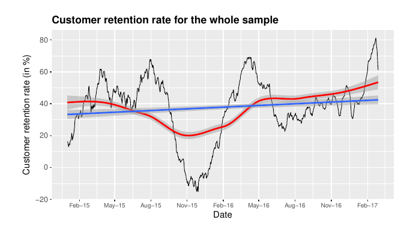
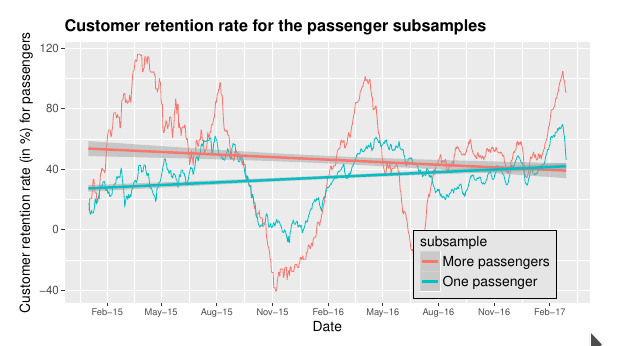
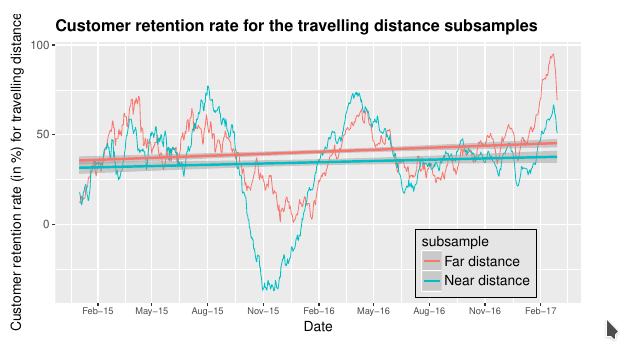
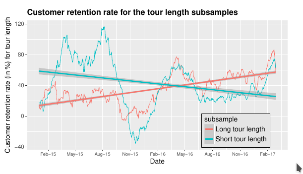
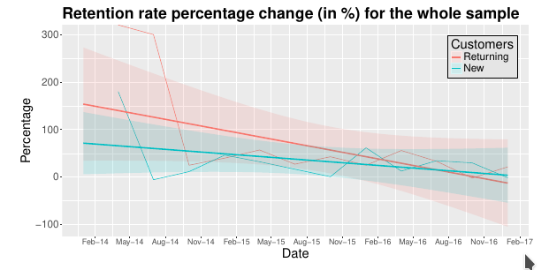
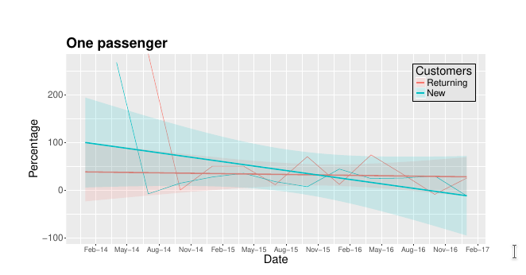
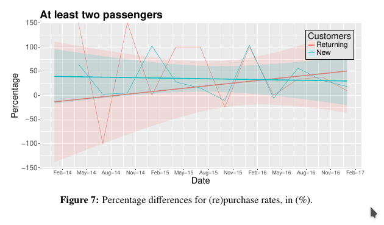
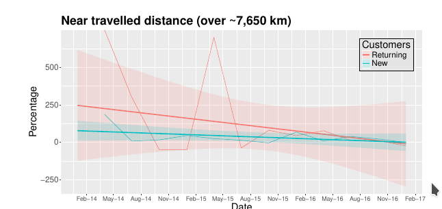
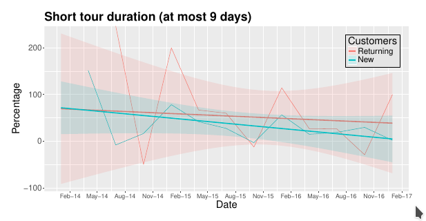
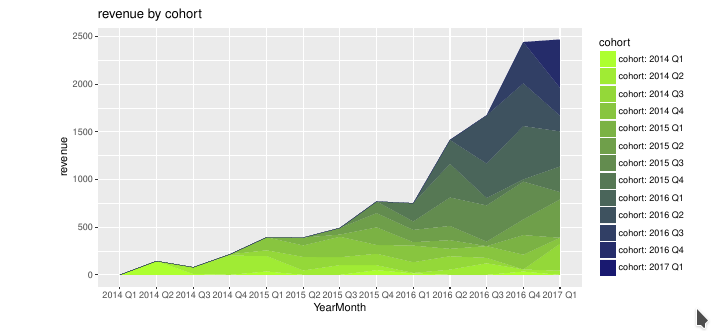
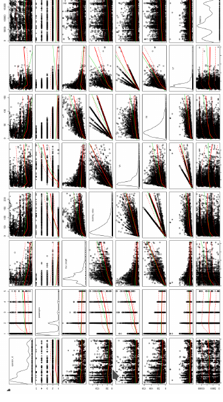
