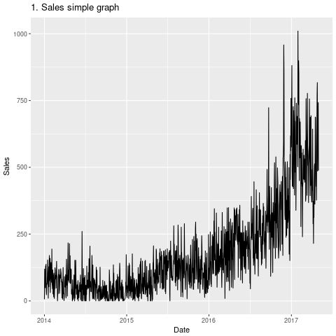
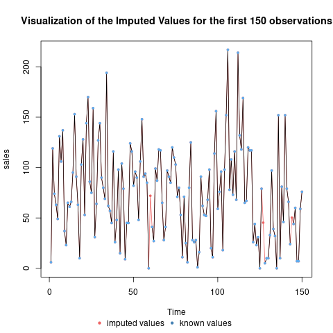
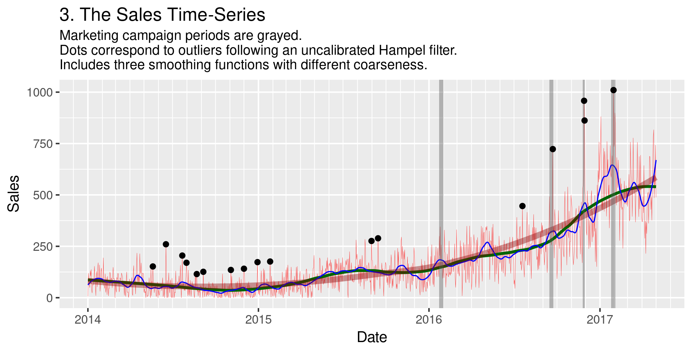
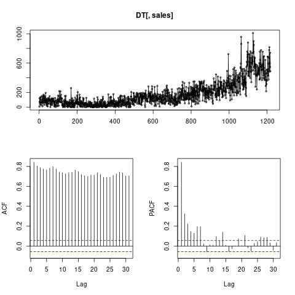

# Overview - under editing
In this sample, I analyze a sales time-series and I identify whether there is a permanent impact of marketing campaigns on a sales time-series.
I also forecast the sales time-series for one month with and without an imminent marketing campaing using ARMAX modelling.
[TOC levels=1-3]: # "#### Table of Contents"
#### Table of Contents
- [Heading **some bold** 1](#heading-some-bold-1)
    - [Heading 1.1 _some italic_](#heading-11-some-italic)
        - [Heading 1.1.1](#heading-111)
        - [Heading 1.1.2  **_some bold italic_**](#heading-112--some-bold-italic)
- [Heading 2](#heading-2)
    - [Heading 2.0.1](#heading-201)
# R and Data preparation 
## Required R packages
For the analysis, start by installing the necessary packages.
This step can be skipped if we have already installed the necessary packages.

imputeTS

```r
sapply(c('astsa', 'forecastxgb', 'TStools', 'smooth', 'GDMH', 'caret', 'nnet', 'tsoutliers', 'colorout', 'data.table', 'randomNames', 'xtable', 'lubridate', 'compare', 'ggplot2', 'zoo',
     'scales', 'stringr', 'foreach',  'gridExtra',
     'colorout', 
     'tseries', 'urca',
     # 'CADFtest',
     'fUnitRoots', 
     'sos', 
     'stats', 
     'lmtest', 
     #'rasterVis' 
     # 'bigalgebra', 'bigmemory', 'biglm',
     'pracma', 
     'Matrix',# for sparse
     'slam', 'prophet', 'RcppArmadillo', 'Rcpp', 'padr',
     'parallel', 'foreach', 'doParallel', 'shiny', #'lineprof',
     'rbenchmark', 'profvis', 'formula.tools', 'sandwich',
     'lattice', 'xts', 'imputeTS', 'strucchange', 'car', 'forecast', 'R.utils', 'GGally', 'zoom', 'TSA', 'foreign'
     ), install.packages) # install packages
```

Next, load them with:
```r
sapply(c('astsa', 'forecastxgb', 'TStools', 'smooth', 'GDMH', 'caret', 'nnet', 'tsoutliers', 'colorout', 'data.table', 'randomNames', 'xtable', 'lubridate', 'compare', 'ggplot2', 'zoo',
     'scales', 'stringr', 'foreach',  'gridExtra',
     'colorout', 
     'tseries', 'urca',
     # 'CADFtest',
     'fUnitRoots', 
     'sos', 
     'stats', 
     'lmtest', 
     #'rasterVis' 
     # 'bigalgebra', 'bigmemory', 'biglm',
     'pracma', 
     'Matrix',# for sparse
     'slam', 'prophet', 'RcppArmadillo', 'Rcpp', 'padr',
     'parallel', 'foreach', 'doParallel', 'shiny', #'lineprof',
     'rbenchmark', 'profvis', 'formula.tools', 'sandwich',
     'lattice', 'xts', 'imputeTS', 'strucchange', 'car', 'forecast', 'R.utils', 'GGally', 'zoom', 'TSA', 'foreign'
     ), require, character.only = TRUE) # load packages
```

## Loading and preparing the data series
I have saved the data series as `data/anonymized-forecasting-data.csv`.
We can confirm this within R (under a Linux OS):

```r
system('ls data/*.csv')
# data/anonymized-forecasting-data.csv
```

Using the amazing `data.table` package we import the data as a `DT` `data.table` object:
```r
DT <- fread('data/anonymized-forecasting-data.csv')
```

It's a good idea to check the structure and summary of the object.
```r
str(DT)
# Classes ‘data.table’ and 'data.frame':  1200 obs. of  4 variables:
#  $ V1       : chr  "1" "2" "3" "4" ...
#  $ date     : chr  "2014-01-01" "2014-01-02" "2014-01-03" "2014-01-04" ...
#  $ webvisits: int  27 25 27 50 44 37 34 39 33 27 ...
#  $ sales    : int  6 119 74 63 49 131 106 137 37 23 ...
#  - attr(*, ".internal.selfref")=<externalptr> 

summary(DT)
#       V1                date             webvisits           sales       
#  Length:1200        Length:1200        Min.   :   0.00   Min.   :   0.0  
#  Class :character   Class :character   1st Qu.:  70.75   1st Qu.:  57.0  
#  Mode  :character   Mode  :character   Median : 129.00   Median : 123.0  
#                                        Mean   : 229.59   Mean   : 178.9  
#                                        3rd Qu.: 338.25   3rd Qu.: 242.5  
#                                        Max.   :1003.00   Max.   :1010.0 
```

Our data sources can have different layouts and some necessary adjustments may be required.
In our case, we remove the first index column, `V1`, and we fix the `date` column which currently is read as a string. Among others, converting the numbers from a character string to a `numeric` may also be required for other `.csv` files.
Of course, we could do the `date` conversion using the appropriate `fread()` option `colClasses` and drop the first column using the `drop` option.
In the rest of the document I skip such trivial details and I also take similar steps for both of the time-series (`webvisits` and `sales`) to keep the text short.
```r
DT[, c('V1', 'date') := .(NULL, as.Date(date))]
```
# Heading **some bold** 1
## Heading 1.1 _some italic_
### Heading 1.1.1
### Heading 1.1.2  **_some bold italic_**
# Heading 2
### Heading 2.0.1
Now we have the following `DT`
```r
str(DT)
# Classes ‘data.table’ and 'data.frame':  1200 obs. of  3 variables:
#  $ date     : Date, format: "2014-01-01" "2014-01-02" ...
#  $ webvisits: int  27 25 27 50 44 37 34 39 33 27 ...
#  $ sales    : int  6 119 74 63 49 131 106 137 37 23 ...
#  - attr(*, ".internal.selfref")=<externalptr> 
```
I also create a simple time-series plot to see if everything looks fine.
```r
png(file= 'figures/01-simple-sales-graph.pdf')
ggplot(data = DT, aes(date, sales)) + geom_line() + ggtitle('1. Sales simple graph') + ylab('Sales') + xlab('Date')
dev.off()
```



## Data quality {#preparation}
Let's see if we have any missing values; days with no data.
Create a sequence of dates from the first till the last day of `DT`.
```r
date.grid <- seq(as.Date(min(DT[, date])), as.Date(max(DT[, date])), by = 'day')
length(date.grid)
# [1] 1217
nrow(DT)
# [1] 1200
```

It seems we do have 17 missing values.
Which are they? 
R comes with set operation functions (?setdiff) and we can use a set difference to find them.
```r
setdiff(as.character(date.grid), as.character(DT$date))
#  [1] "2014-03-01" "2014-05-07" "2014-05-24" "2014-08-09" "2014-08-13"
#  [6] "2014-09-07" "2014-09-13" "2014-10-01" "2014-10-11" "2014-10-17"
# [11] "2014-10-18" "2014-10-19" "2014-10-24" "2014-12-06" "2014-12-21"
# [16] "2014-12-24" "2015-09-19"
```
All in all, the 17 missing values are located in the first half of the the time series. 
From the graph above, we observe noisy seasonality and complex series.
Hence, we use a Kalman filter to impute the missing values (in simpler cases linear interpolation could also be fine).
Note, that we proceed to such an interpolation because it does not change the outcome of the analysis! 

```r
date.grid.DT <- data.table(date = c(date.grid))
setkeyv(DT, c('date'))
setkeyv(date.grid.DT, c('date'))

DT <- DT[date.grid.DT]

DT[, c('webvisits.withNA', 'sales.withNA') := .(webvisits, sales)]
DT[, c('webvisits', 'sales') := .(na.kalman(webvisits), na.kalman(sales))]

png(file= 'figures/02-first-150-imputed-values-for-sales-graph.png')
plotNA.imputations(DT[1:150, sales.withNA], DT[1:150, sales], ylab = 'sales', main = 'Visualization of the Imputed Values')
dev.off()
```



Now, we are ready to start our analysis!

# Analysis 
## Helicopter view of the data

As in theory, there seems to be four components in the time series (trend, cycle, seasonal, random error). 
Data are very noisy. 
Ideally, we'd like to have a large increase during and after the marketing campaings, but this does not happen.
Since there is an intervention variable (Marketing Campains) an ARMAX model seems appropriate. 
Other instrumental variables (IVs) like the web visits time series can enter the ARMAX, too.

The following Figure shows that the `sales` seem to follow: 
 * a parallel movement in 2014-early:2015, 
 * a slightly upward trend during early:2015–early:2016, and 
 * a more vigorous upward trend since mid:2016 with some indication of a potential parallel movement after early:2017. 
 
This suggest that a regime-switching model could also be appropriate for such data. 
We don’t see linear, but a polynomial, trend for the whole time-series, which is common for sales data. 
We also see structural breaks (at least in level and variance) which influences the unit root tests and need further exploration. 
I follow [Bai and Perron (2003)](http://onlinelibrary.wiley.com/doi/10.1002/jae.659/abstract) and the BIC criterion suggests 3 breaks (four would not make a large difference, thouggh) and confirms my visual perception.

## Graph with outliers and smoothing curves
Let's create a beautiful graph for the data!

First, we detect the outliers using the Hampel filter.
```r
outliers.sales <- DT[, sales]
plot(outliers.sales, type = 'l')
omad <- hampel(outliers.sales, k = 20, t0 = 3)
plot(outliers.sales, type='l')
points(omad$ind, outliers.sales[omad$ind], pch=21, col='red')
outliers.NAs <- rep(NA, length(DT[, sales])) 
outliers.NAs[omad$ind] <- DT[, sales][omad$ind]
```

If we are further interested in the outliers, we should proceed to parameter calibration for the Hampel filter, but for this "tutorial analysis" it is not necessary.
Ideally, we forecast with and without the outliers, calibrate their corrections and identify whether they are indeed outliers or indicate a response to an event (which seems plausible for the 3 outliers during the marketing campaigns). 
Please refer to [Tsay (1988)](http://onlinelibrary.wiley.com/doi/10.1002/for.3980070102/abstract) and [Watson (2001)](http://eprints.whiterose.ac.uk/2209/1/ITS261_WP362_uploadable.pdf) for various outlier types (additive/level shifts/etc.) and techniques for their correction as a starting point. 
At a more advanced stage, we could use a non-linear moving window and parameter calibration.

The following figure, also includes three smoothing functions with different coarseness, following a LOESS fitted curve with correspondingly different parameters.

```r
campaign.dates <- data.frame(campaign.start =  c(as.Date('2016-01-23'),
                                                as.Date('2016-09-15'),
                                                as.Date('2016-11-25'),
                                                as.Date('2017-01-25')
                                                ), campaign.end = c(
                                                as.Date('2016-02-01'),
                                                as.Date('2016-09-23'),
                                                as.Date('2016-11-29'),
                                                as.Date('2017-02-03')))

figure <- ggplot(DT) +
          geom_line(aes(x = date, y = sales), colour = 'red', size = 0.1, alpha = 0.7) +
          geom_line(aes(x = date, y = loess(sales ~ c(1:length(sales)), span = 0.3)$fit), colour = 'darkgreen',  size = 1) +
          geom_line(aes(x = date, y = loess(sales ~ c(1:length(sales)), span = 0.05)$fit), colour = 'blue',  size = 0.4) +
          geom_line(aes(x = date, y = loess(sales ~ c(1:length(sales)), span = 0.95)$fit), colour = 'darkred',  size = 2, alpha = 0.4) +
          scale_x_date(  date_minor_breaks = '1 month', date_labels = '%Y', date_breaks = '1 year') +
          geom_rect(data = campaign.dates, aes(xmin = campaign.start, xmax = campaign.end, ymin = -Inf, ymax = Inf), alpha = 0.4) +
          geom_point(aes(x = date, y = outliers.NAs)) +
          labs(title = '3. The Sales Time-Series',
               subtitle = 'Marketing campaign periods are grayed. \nDots correspond to outliers following an uncalibrated Hampel filter.\nIncludes three smoothing functions with different coarseness.',
               y = 'Sales',
               x = 'Date') + 
          list() # I use + list() in the end as a little trick to add more options at will by commenting/uncommenting the corresponding lines
      
ggsave(filename = 'figures/03-sales-graph.png', plot = figure, height = 90, units = 'mm')
```



## Statistical characteristics
### Autocorrelation structure

I start with correlation analysis.

```r
png(file= 'figures/04-ACF-and-PACF-of-sales.png')
tsdisplay(DT[, sales], main = "4. DT[, sales]")
dev.off()
```


Figure 4 shows that the ACF slope declines smoothly with shallow peaks every 7 periods (days). 
The peaks after the 7th day can be considered weak statistically, since they can be related to the aforementioned weekly seasonality. 
The smooth decline is indicative for the existence of a trend. 
Hence, the ACF implies trend and seasonality. 
The graph of the PACF confirms, since the statistical
significance of the peaks after the 7th period seems week.
For further analysis, we could also examine lagged cross-correlation between `sales` and `webvisits` (prewhitening the series and using the `ccf()` function in R). 
Cross-correlation would indicate whether people examine thoroughly the product before their order.

Moreover, the sales time-series graph of the previous section shows a gradual increase in variance over time while the level of enquiries also increases. 
This could be an indication of ARCH errors/innovations if it didn’t seem so gradual but clustered. 
Hence, I could transform the enquiries with a power transformation, which s seems to be the best simple transformation. 
The optimal Box-Cox λ refers to a logarithmic transformation and transposes the increased variance position to the beginning of the series.
For experimentation, please refer to the `BoxCox.lambda()` and `BoxCox()` functions of the `forecast` package in R.

### Breaks
Ideally, we do not want mean, variance, autocorrelation and relationship breaks for the time-series for sound inference. 
[Hansen (2012)](https://www.ssc.wisc.edu/~bhansen/crete/crete5.pdf) says there is no good theory for forecasting for series with breaks. 
According to [Pesaran and Timmermann (2007)](https://www.sciencedirect.com/science00/article/pii/S0304407606000418), in not an identical case, however, the optimal window for starts a bit before the last break. 
Bai and Perron (2003) method indicates considering three breaks as optimal. 
Even in non optimal cases with 2, 4 or 5 breaks the last break is on 2016-10-30. Hence, I consider 2016-09-01 as the start of my estimation window. 
For further exploration, Pesaran and Timmermann propose a calculation for the ideal estimation windows which I skip as it does not seem so critical for the purpose of this analysis.
Another possibility would be to consider outlier events, like level shifts, but there is no need for extensive intervention analysis throughout the series for this analysis.

To find out the breaks we work with the `tsoutliers` package in R.
```r
my.ts.DT <- DT[, .(date, sales, webvisits)] 
day.of.year <- as.numeric(format(my.ts.DT[, date][1], '%j'))
my.ts <- ts(my.ts.DT[, sales], start = c(2014, day.of.year), frequency = 365)
outliers.tso <- tso(my.ts) # it takes some minutes
plot(outliers.tso)
bp.ri <- breakpoints(my.ts ~ 1)
summary(bp.ri)
# 
#          Optimal (m+1)-segment partition: 
# 
# Call:
# breakpoints.formula(formula = my.ts ~ 1)
# 
# Breakpoints at observation number:
#                             
# m = 1                   985 
# m = 2           742     1034
# m = 3       481     839 1034
# m = 4   213 481     839 1034
# m = 5   213 481 663 845 1034
# 
# Corresponding to breakdates:
#                                                          
# m = 1                                           2016(255)
# m = 2                       2016(12)            2016(304)
# m = 3             2015(116)           2016(109) 2016(304)
# m = 4   2014(213) 2015(116)           2016(109) 2016(304)
# m = 5   2014(213) 2015(116) 2015(298) 2016(115) 2016(304)
# 
# Fit:
#                                                          
# m   0        1        2        3        4        5       
# RSS 36382654 13979836 10330573  9390829  9328042  9281676
# BIC    16010    14860    14506    14404    14410    14418

plot(bp.ri) # for three breaks
plot(my.ts, type = 'l')
lines(fitted(bp.ri, breaks = 3), col = 4)
lines(confint(bp.ri, breaks = 3))
```

Hence, for the day of the break, we choose the 1034th day of our time-series which corresponds to 30th of October of 2016:
```r
my.ts.DT[1034]
#          date sales webvisits
# 1: 2016-10-30   273       455
```
For further exploration, the `strucchange` package in R is a good starting point.
Example graphs:
```r
plot(Fstats(my.ts ~ 1))
plot(efp(my.ts ~ 1, type = 'Rec-CUSUM'))
plot(efp(my.ts ~ 1, type = 'OLS-CUSUM'))
```

```r
my.ts <- ts(my.ts.DT[date >= '2016-09-01', sales], start = c(2014, 245), frequency = 365)
plot.ts(my.ts)

campaign.dates.truncated <- data.frame(
                   campaign.start =  c(
                           #                 as.Date('2016-01-23'),
                           as.Date('2016-09-15'),
                           as.Date('2016-11-25'),
                           as.Date('2017-01-25')
                           ), campaign.end = c(
                           #                 as.Date('2016-02-01'),
                           as.Date('2016-09-23'),
                           as.Date('2016-11-29'),
                           as.Date('2017-02-03')))


figure <-   ggplot(DT[date >= '2016-09-01']) +
    geom_line(aes(x = date, y = sales), colour = 'red', size = 0.4, alpha = 0.7)  +
    geom_rect(data = campaign.dates.truncated, aes(xmin = campaign.start, xmax = campaign.end, ymin = -Inf, ymax = Inf), alpha = 0.4) +

    #              scale_x_date(  date_minor_breaks = '1 month', date_labels = '%Y',
    scale_x_date( date_minor_breaks = '1 week',  date_labels = '%m - %Y', # http://strftime.org/
             date_breaks = '1 month'                        ) +
             geom_point(aes(x = date, y = outliers.NAs)) +
ggtitle('Sales, estimation window') +
ylab('Sales') + xlab('Date')+
list()

ggsave(filename = 'figures/10-estimation-window-graph.png', plot = figure, height = 100, units = 'mm')
```


### Stationarity
We must also perform stationarity tests (see `adf.test()`, `pp.test()`, `kpss.test()` of the `tseries` package in R). 
Sales and Web Visits seem to be cointegrated by the Johansen test (see `ca.jo()` of the `urca` package in R), so stationarity is not an issue.
The transformed series are stationary under the ADF/PP/KPSS tests. 
The not-transformed series are obviously not stationary. 
In rough terms, for the Web Visits, there seems to be a parallel movement in 2014-2015, a slightly upward trend during 2015-2016, an abrupt since late 2015/early 2016 which holds till today or has faded after late 2016. 
ADF, DF-GLS do not indicate a stochastic trend. 
Nevertheless, there seems to be visually and with a test deterministic trend (`sales` increase by 0.372453 per day (`summary(lm(DT[, sales] ~ seq(1:length(DT[, sales]))))`)). 
Note that proper trend analysis in serially correlated series like in our case demands the calculation of Vogelsang ([1998a](https://rmgsc.cr.usgs.gov/outgoing/threshold_articles/Vogelsang1998b.pdf), [1998b](https://www.jstor.org/stable/2527353?seq=1#page_scan_tab_contents)) statistics. 
Moreover, the series are bounded (take values in [0, 1000]) so the unit root tests make sense.

```r
my.ts <- ts(my.ts.DT[date >= '2016-09-01', sales], start = c(2014, 245), frequency = 7)
my.webvisits <-  as.matrix(my.ts.DT[date >= '2016-09-01', webvisits], start = c(2014, 245), frequency = 7)

my.matrix <- as.matrix(cbind(my.ts, my.webvisits))
summary(ca.jo(my.matrix))
```


## ARIMA modelling

ts.DT <- DT[, .(date, sales, webvisits)] 


The best fitted simple ARIMA with seasonality is the ARIMA(1,1,1)(0,0,1)[7] with BIC 1945.06. Ideally, I would proceed to cross-validation/out-of-sample tests and extensive calibration, though. Ljung-Box shows that the residuals can be considered white noise. 
The portmanteau test does not reveal serial correlation for the first 20 lags of the model and I go forward to forecasting.

```r
estimation.window.DT <- my.ts.DT[date >= '2016-09-01']
estimation.window.sales <- ts(estimation.window.DT[, sales], start = 0, frequency = 7)
auto.arima(estimation.window.sales, max.p = 7, max.q = 7, max.d = 2, seasonal = TRUE, max.P = 7, max.Q = 7, max.D = 2, trace = FALSE, stepwise = TRUE, max.order = 20, allowmean = TRUE, ic = 'bic')
```

I only mention some highlights of further experimentation, to conserve space. 
For the transformed series, the best fitted ARMA without seasonality is the ARMA(2,0,1). 
The best fitted ARMA with seasonality is the ARMA(4,0,3)(0,0,2)[7]. 
For this analysis, I skip cross-validation/out-of-sample tests, to conserve space.
I would choose the ARMA(2,0,1) for conservative reasons:
it is simpler, the AIC/BIC of the two are very close and ARIMA(4,0,3)(0,0,2)[7] may be prone to overfitting. 
However, for the purposes of this particular analysis and its constraints I do not make any transformation calibration. 
For the purposes of accurate work, such analyses are advised to be automated through a [make-type-of-file](https://robjhyndman.com/hyndsight/makefiles/) or a master script.

Note that ARIMA-based intervals are generally too narrow and that historical patterns will repeat for the forecasting period.


# Expansions
The above analysis is obviously preliminary, especially for time series that deal with thousands/millions of sales and there are a lot at stake.
The general analytical path could be consisted of these steps:
 * visual inspection, standard statistical tests
 * identify the best time series model, try to encompass various relevant variables that should influence the sales
 * compare it with other types of models as bayesian structural time series models (see the [CausalImpact](https://google.github.io/CausalImpact/CausalImpact.html) package in R), machine learning/xgb/etc. models 
 * identify causal relationships among the time-series, etc...
 * perform out-of-sample analysis/cross-validation
 * automate the process and create potential automatic report generation through the
power of R or/and python. The goal is to have automatic predictions for every
segment of the market, as real-time as possible, for various metrics and time-series.

